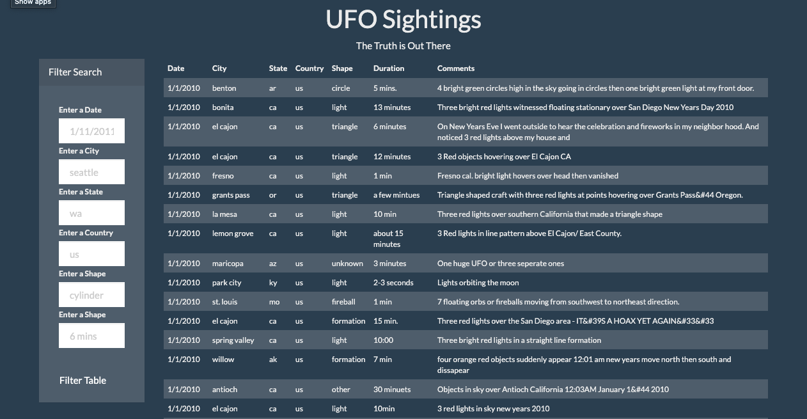
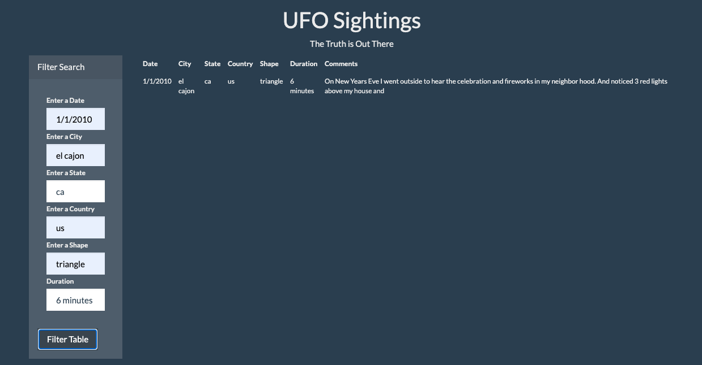

# javascript-challenge

To run this js open the index.html file in the browser. Once the page is loaded you can type values into each of the filters into the forms on the left hand side of the page and press the 'filter table' button to run. Make sure that the format matches that of the default values for each form. Note all forms will need to have a value for the filter to run properly. 

See the below image for an example of a successful filter

